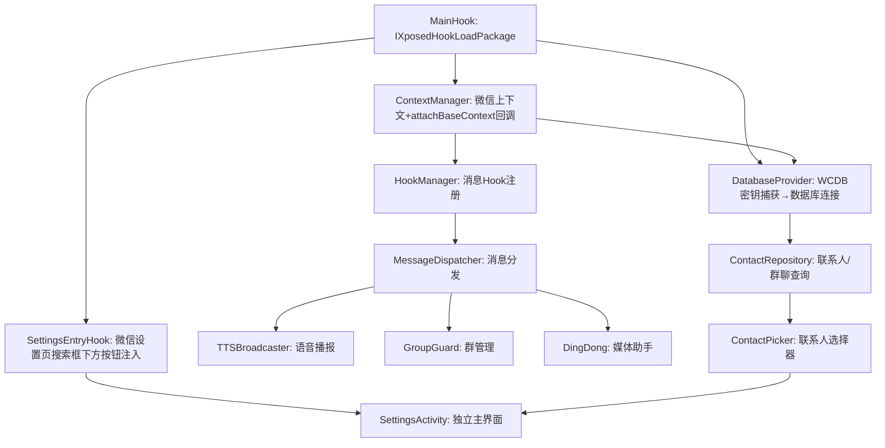
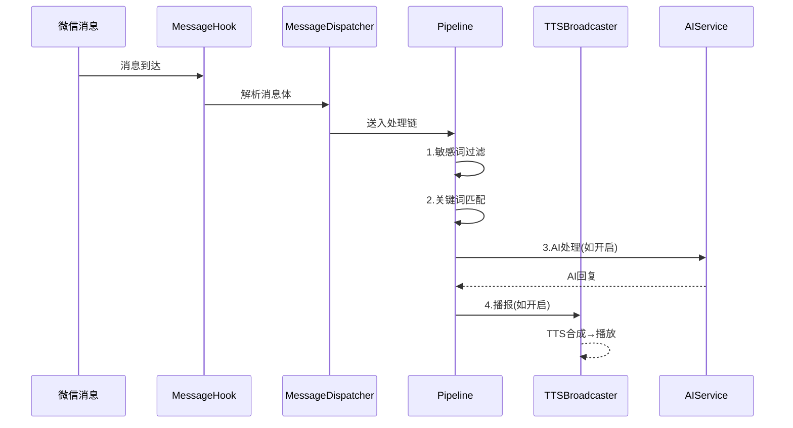

# 微信助手 v3 - 技术设计文档

Feature Name: wechat-helper-v3
Updated: 2026-07-21

## 描述

从零开发全新的 LSPosed/Xposed 微信模块，包名 `com.leshao.v3`，目标微信 8.0.72~8.0.76。UI 入口为微信设置页搜索框下方轻量跳转按钮，不嵌入原生页面布局。完全不引用 LeShaoWeChat v2.1 或 WeKit 源码。

## 硬性约束

1. 仅轻量 Hook 微信设置页面（搜索框下方添加跳转按钮），只做跳转，不嵌入 UI 布局
2. 数据库 Hook/WCDB 密钥捕获等待微信 attachBaseContext 执行完毕再初始化
3. 微信版本区间 8.0.72~8.0.76，LSPosed Xposed API 102
4. 所有关键步骤输出日志：密钥捕获、Hook激活、数据库连接、联系人查询
5. 须编写 R8 混淆规则保护反射相关类与方法
6. Phase 1 优先级：数据库密钥抓取 > 联系人/群聊列表查询 > 设置页跳转入口 > 基础主界面 Activity

## 架构



## 核心模块

### 1. 入口层 (Entry Layer)

| 组件 | 职责 |
|------|------|
| `MainHook` | 实现 IXposedHookLoadPackage, 进程注入入口 |
| `ActivityEntry` | Hook微信LauncherUI或SettingsUI注入独立Activity |
| `ModuleContext` | 全局单例持有 Context/ClassLoader/APK路径 |

### 2. Hook 层 (Hook Layer)

| 组件 | 职责 |
|------|------|
| `HookManager` | 统一管理所有 Xposed Hook 的注册/注销 |
| `MessageHook` | Hook a2.b(3 params) 拦截消息处理 |
| `AntiRecallHook` | Hook modelmulti 防撤回 |
| `RedPacketHook` | Hook luckymoney 抢红包 |
| `FriendRequestHook` | Hook 好友申请自动通过 |
| `ChatroomHook` | Hook chatroom 群事件/成员变更 |

### 3. 调度层 (Dispatch Layer)

| 组件 | 职责 |
|------|------|
| `MessageDispatcher` | 接收 Hook 消息，按优先级分发给各处理器 |
| `Pipeline` | 责任链模式: 过滤 → 关键词匹配 → AI处理 → 播报 |

### 4. 业务层 (Business Layer)

| 组件 | 职责 |
|------|------|
| `TTSBroadcaster` | TTS 队列/引擎管理/播报 |
| `GroupGuard` | 入群欢迎/退群提醒/防广告/自动踢人/黑名单 |
| `DingDong` | 点歌/天气/笑话/金句/视频解析 |
| `AutoReply` | 关键词回复 |
| `AIService` | DeepSeek/火山方舟 API 调用 |
| `SchedulerService` | 定时任务/群发/公告 |
| `VoiceRelay` | 语音中继自动播放 |
| `StatsCollector` | 消息统计/活跃统计/投票 |

### 5. 数据层 (Data Layer)

| 组件 | 职责 |
|------|------|
| `DatabaseProvider` | WCDB Hook 获取 SQLiteDatabase，提供 rcontact 查询 |
| `ContactRepository` | 联系人和群聊数据仓库 (缓存 + SQL) |
| `SettingsRepository` | SharedPreferences 封装，配置读写 |
| `LogWriter` | 文件日志写入 |

### 6. UI 层 (UI Layer)

| 组件 | 职责 |
|------|------|
| `SettingsActivity` | 独立 Activity 主界面 |
| `ContactPicker` | 联系人/群聊选择器 |
| `Fragment/Tab` | 功能分组标签页 |

## 数据流



## 数据模型

### WeChatMessage

```java
class WeChatMessage {
    String talker;      // 会话 wxid (私聊/群聊)
    String senderWxid;  // 实际发送者 wxid
    String content;     // 消息文本内容
    int type;           // 消息类型枚举
    long createTime;    // 创建时间戳
    boolean isGroup;    // 是否群聊
}
```

### Contact

```java
class Contact {
    String wxid;        // 微信ID
    String nickname;    // 昵称
    String remarkName;  // 备注名
    String alias;       // 自定义微信号
    int type;           // 联系人类型(位掩码)
    boolean isGroup;    // 是否群聊
}
```

### Settings 配置结构

```java
class ModuleConfig {
    boolean masterSwitch;
    
    // TTS
    String ttsEngine;       // "peiyin" | "wusound" | "system"
    String ttsApiKey;
    String ttsVoiceId;
    int announceIntervalMs; // 播报间隔
    
    // 播报类型掩码
    int announceTypeMask;   // 位掩码: Text=1, Image=2, Video=4, ...
    Set<String> announceWhitelist; // 播报白名单 wxid
    
    // 群管理
    boolean welcomeEnabled;
    String welcomeMsg;
    boolean autoKickEnabled;
    Map<String, Integer> kickThreshold;  // groupId → 阈值
    
    // 安全
    boolean antiRecall;
    boolean redPacketGrab;
    Set<String> sensitiveWords;
    
    // 免打扰
    boolean quietEnabled;
    int quietStartHour;
    int quietEndHour;
    
    // AI
    boolean deepseekEnabled;
    String deepseekApiKey;
    
    // 定时
    List<ScheduledTask> scheduledTasks;
}
```

## WCDB 数据库访问方案

采用 Hook `com.tencent.wcdb.database.SQLiteDatabase` 的 OpenHelper 或 openDatabase 方法，在微信初始化完毕后拦截数据库打开操作，捕获 WCDB 加密密钥和 SQLiteDatabase 实例。

**初始化时机**: 等待微信 `Application.attachBaseContext` 回调完成后再注册数据库 Hook，避免 DexFile 加载失败。

工作流程:
1. Hook `Application.attachBaseContext` → 标记微信初始化完成
2. 通过 `lpparam.appInfo.sourceDir` 获取微信 APK 路径，使用 DexFile 枚举 `com.tencent.wcdb.*` 包下类
3. Hook `SQLiteDatabase.openDatabase()` 或其内部 OpenHelper
4. 捕获数据库打开时的参数（路径+密钥）
5. 通过数据库文件路径判断是否为 EnMicroMsg.db（核心联系数据库）
6. 用捕获的密钥打开同数据库连接，执行 rcontact 表查询

## 入口层实现方案

### 设置页跳转入口

1. 在 `Application.attachBaseContext` Hook 回调中初始化上下文管理器
2. 延迟 Hook 微信设置 Activity（`com.tencent.mm.ui.tools.MMTextInputLayout` 或搜索框相关视图）
3. 在设置页搜索框下方动态添加一个 Button，文本"乐少助手"
4. 点击跳转到模块独立 `SettingsActivity`
5. Button 使用微信主题色风格但不嵌入微信原生布局

## 独立 Activity 入口方案

1. 注册 Activity 在 AndroidManifest 中，使用 `Theme.AppCompat` 独立样式
2. 通过上述设置页按钮或调试入口启动
3. Activity 架构: ViewPager/Fragment + 底部 Tab 分组
4. Phase 1 仅实现基础壳 Activity + 联系人选择器 Fragment

## R8 混淆规则

```proguard
# 保持 Xposed 入口
-keep class com.leshao.v3.MainHook { *; }

# 保持反射调用类
-keep class com.leshao.v3.reflect.** { *; }

# 保持数据库相关
-keep class com.leshao.v3.db.** { *; }

# 保持数据模型
-keep class com.leshao.v3.model.** { *; }
```

## 错误处理

1. 所有 Hook 方法使用 try-catch 包裹，单个 Hook 失败不影响其他
2. 数据库查询失败回退到空列表
3. TTS 引擎不可用时自动降级到系统 TTS
4. API 调用失败返回友好提示而非崩溃
5. 所有异常记录到日志文件

## 测试策略

1. 单元测试: Repository 层和工具类
2. 集成测试: Hook 注册和消息解析
3. 手动测试: 在 WeChat 3140 真机/模拟器上验证每个功能

## 渐进式实施 (Phase Plan)

| Phase | 优先级 | 功能 | 核心产出 |
|-------|--------|------|---------|
| P1.1 密钥 | ★★★ | attachBaseContext Hook + WCDB openDatabase Hook + 密钥捕获 | `ContextManager`, `DatabaseProvider` |
| P1.2 查询 | ★★★ | rcontact 直查联系人/群聊列表 | `ContactRepository`, `ContactPicker` |
| P1.3 入口 | ★★☆ | 微信设置页搜索框下方跳转按钮 | `SettingsEntryHook` |
| P1.4 界面 | ★☆☆ | 基础 SettingsActivity + 联系人选择器 Fragment | `SettingsActivity`, `MainFragment` |
| P2 播报 | | TTSBroadcaster + MessageDispatcher + Pipeline | 3-4 文件 |
| P3 群管 | | GroupGuard + AutoReply + Security | 3-4 文件 |
| P4 媒体 | | DingDong + AIService | 2-3 文件 |
| P5 自动化 | | SchedulerService + MassMessenger + VoiceRelay | 3-4 文件 |
| P6 统计 | | StatsCollector + VoteManager | 2-3 文件 |

## 关键决策

1. **不依赖任何第三方框架** — 仅 Xposed API 102 + 标准 Android SDK
2. **WCDB Hook 捕获密钥替代 DexKit** — 利用微信自身数据库打开流程获取密钥和连接
3. **attachBaseContext 后初始化** — 等待微信 ClassLoader 完全就绪再注册 Hook
4. **设置页轻量按钮** — 不嵌入微信原生布局，降低兼容风险
5. **责任链 Pipeline** — 消息处理解耦，新增处理步骤无需修改现有代码
6. **R8 规则保护反射** — 所有通过反射调用的类与方法须 keep
