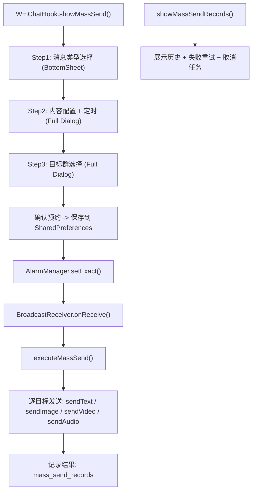
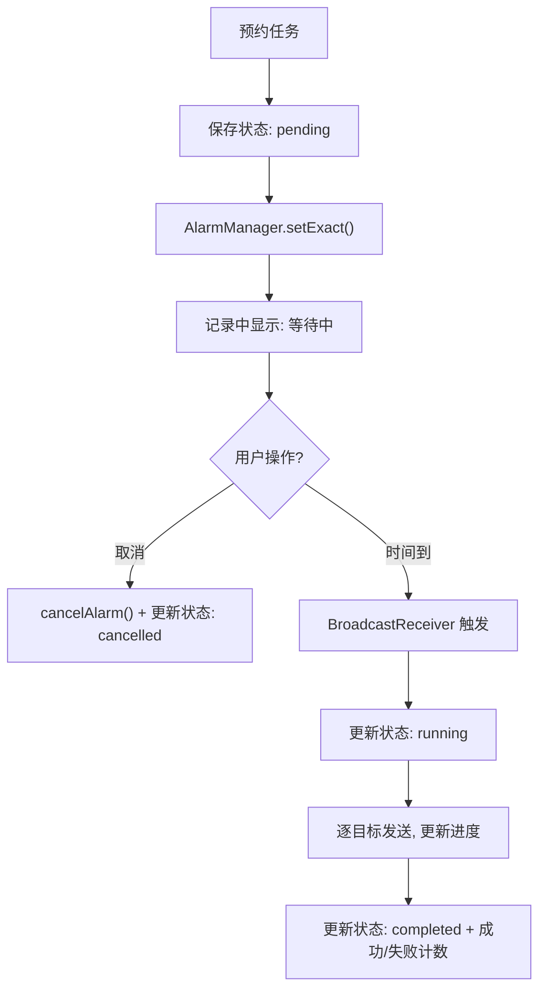

# 乐少万群定时群发增强

Feature Name: mass-broadcast-enhancement
Updated: 2026-08-10

## 描述

重构 WmChatHook 中现有的"乐少万群定时群发"功能，采用三步向导式流程（选择类型 → 配置内容 → 选择目标），新增纯图片/纯视频/图文混合消息类型，增加任务启停控制，增强历史记录展示。

---

## 架构



## 组件与接口

### 1. WizardManager（向导容器，WmChatHook 内部类）

三步向导共用单个 AlertDialog 实例，通过替换 contentView 实现步骤切换。

核心字段:
```java
class WizardManager {
    Dialog dlg;
    int step = 0;                     // 0-类型选择, 1-内容配置, 2-目标选择
    int selectedType = -1;            // 消息类型索引
    Set<String> selectedTargets;     // 已选目标 wxid set
    long scheduledTimeMs = 0;        // 预约时间戳
    String textContent = "";         // 文字内容
    List<String> imagePaths;         // 多图路径列表
    String videoPath;                // 视频路径
    String audioPath;                // 音频路径
    boolean randomDelay = true;      // 随机延迟开关
    String taskId;                   // 任务唯一 ID
}
```

### 2. 消息类型定义（7种）

```
索引  类型键          显示名         附件
0   text            文本消息       无
1   image           图片消息       多图
2   video           视频消息       单视频
3   image_text      图文消息       单图 + 文字
4   video_text      文视消息       单视频 + 文字
5   image_mixed     图文混合       多图 + 文字
6   voice           语音消息       音频文件
```

旧版移除: `location_text`(位置文本), `card_text`(名片文字)

### 3. 数据模型

#### SharedPreferences 键 (wm_prefs)

| Key | 类型 | 说明 |
|-----|------|------|
| `mass_send_text` | String | 文字内容 |
| `mass_send_type` | String | 消息类型键 |
| `mass_send_time` | String | 定时时间戳 |
| `mass_send_targets` | String | JSONArray of wxid |
| `mass_send_images` | String | JSONArray of image file paths |
| `mass_send_video` | String | 视频文件路径 |
| `mass_send_audio` | String | 音频文件路径 |
| `mass_send_delay_enabled` | String | "true"/"false" |
| `mass_send_task_id` | String | 任务唯一 ID |
| `mass_send_records` | String | JSONArray 历史记录 |
| `mass_send_fail_records` | String | JSONArray 失败记录 |
| `mass_send_active_task` | String | JSONObject 当前活跃任务 (含 status/progress) |

#### 记录 JSONObject 结构

```json
{
  "taskId": "uuid",
  "time": 1691664000000,
  "scheduledTime": 1691667600000,
  "type": "image_mixed",
  "typeLabel": "图文混合",
  "targetCount": 15,
  "success": 12,
  "fail": 3,
  "status": "completed",
  "targets": ["room1@chatroom", ...],
  "textPreview": "前20字..."
}
```

### 4. 三步向导 UI 流程

```
Step 1: 类型选择
┌──────────────────────────────┐
│  选择消息类型               │
│  ┌─────┐ ┌─────┐ ┌─────┐   │
│  │文本 │ │图片 │ │视频 │   │
│  └─────┘ └─────┘ └─────┘   │
│  ┌─────┐ ┌─────┐ ┌─────┐   │
│  │图文 │ │文视 │ │图文 │   │
│  │     │ │     │ │混合 │   │
│  └─────┘ └─────┘ └─────┘   │
│  ┌─────┐                    │
│  │语音 │                    │
│  └─────┘                    │
│  [群发记录] [取消] [下一步] │
└──────────────────────────────┘

Step 2: 内容配置
┌──────────────────────────────┐
│  内容配置 - 图文混合       │
│                              │
│  ┌────────────────────────┐  │
│  │ 输入文字内容...        │  │
│  └────────────────────────┘  │
│                              │
│  ┌──┐┌──┐┌──┐┌──┐ ...      │
│  │图1││图2││图3││ + │      │
│  └──┘└──┘└──┘└──┘          │
│                              │
│  发送时间: MM月DD日 HH:mm    │
│  [选择日期时间]             │
│                              │
│  [启用随机延迟(1~10秒)]  ◎  │
│                              │
│  [上一步]           [下一步] │
└──────────────────────────────┘

Step 3: 目标选择 + 确认
┌──────────────────────────────┐
│  选择目标群                │
│                              │
│  已选: 15 个群              │
│  [全选] [反选] [清空]       │
│                              │
│  ┌────────────────────────┐  │
│  │ ☑ 家族群               │  │
│  │ ☑ 同学群               │  │
│  │ ☐ 工作群               │  │
│  │ ...                    │  │
│  └────────────────────────┘  │
│                              │
│  摘要: 图文混合 → 15个群   │
│  时间: 08月15日 14:30      │
│                              │
│  [上一步]          [确认预约]│
└──────────────────────────────┘
```

### 5. 任务启停控制



取消机制: 每个任务用唯一 requestCode (`taskId.hashCode()`) 创建 PendingIntent，取消时用相同 requestCode 调用 `PendingIntent.getBroadcast()` 后 `cancel()`。

## 正确性

1. 向导每步必须验证必填项才允许"下一步"/"确认"
2. Step2→Step3 前确保: 文本或附件至少一项非空 + 时间非空且在未来
3. Step3 确认前确保: selectedTargets 非空
4. 图片发送时自动按9张一批切分
5. 每个目标发送失败不中断后续目标
6. AlarmManager 取消时必须完全匹配 requestCode 和 Intent filter

## 错误处理

| 场景 | 处理 |
|------|------|
| ClassLoader 为空 | 跳过当前目标,记录失败原因 |
| 文件不存在 | 跳过该附件,继续发送文字部分 |
| 发送异常 | 记录失败目标,继续下一个 |
| AlarmManager 取消失败 | 任务状态仍标记为 cancelled,执行时检查状态跳过 |
| SharedPreferences 读取失败 | 使用默认空值,跳过执行 |

## 测试策略

- 单元测试: JSON 序列化/反序列化、图片分批逻辑
- 集成测试: 完整向导流程各步骤切换
- 实机测试: 预约 → 取消 → 重新预约 → 执行 → 查看记录
- 边界测试: 0 张图片、20 张图片分批、空文字、过期时间、0 个目标

## 参考资料

[^1]: WmChatHook.java - 现有群发实现 (当前工作区 `/app/src/main/java/com/leshao/v3/wm/hook/WmChatHook.java`)
[^2]: AppColors.java - 配色系统 (当前工作区 `/app/src/main/java/com/leshao/v3/ui/AppColors.java`)
[^3]: CandyUi.java - UI 工厂方法 (当前工作区 `/app/src/main/java/com/leshao/v3/ui/CandyUi.java`)
[^4]: WmPrefs.java - 偏好设置存储 (当前工作区 `/app/src/main/java/com/leshao/v3/wm/utils/WmPrefs.java`)
