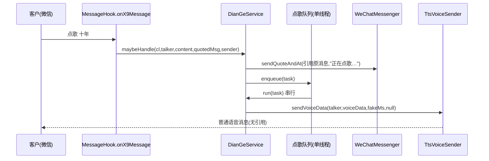

# 点歌受理引用与串行队列

Feature Name: song-request-queue
Updated: 2026-09-28

## Description

在既有「点歌」自动化上增加：点歌受理时用微信原生引用消息回复发起人（默认「正在点歌…」）；最终音频语音消息保持普通语音（不引用）；多个点歌请求进入串行 FIFO 队列，逐个处理。

原生引用能力直接复用 AI 助手实现 `com.leshao.ai.hook.wechat.WeChatMessenger.sendQuoteAndAt(Object quoted, String chatroom, String atWxid, String content, ClassLoader cl)`（`WeChatMessenger.java:116`），其“群聊优先原生引用、失败回退文本”的范式见 `TriggerEngine.java:210`、`:285`。

## Architecture



### 队列粒度（已确认）

**每会话一个串行队列**：同一会话内点歌任务严格按入队顺序逐个执行，不同会话之间互不阻塞。实现为 `ConcurrentHashMap<String, SessionQueue>`，每个 `SessionQueue` 持有 `ArrayDeque<SongTask>` 与 `running` 标记，共用可弹性扩容的 `POOL`(`newCachedThreadPool`) 承载 worker。

- 入队时在会话队列锁内计算 `ahead = (running ? 1 : 0) + queue.size()`（排在本任务前面的任务数，含正在执行的）。
- 队列长度上限 `MAX_QUEUE_PER_SESSION = 10`（不含正在执行者），超出即拒绝并回复“排队已满”。
- 每个会话同一时刻最多一个 `drain` worker 在跑：取出队首 → 执行 → 取下个；队列空则置 `running=false` 退出。

## Components and Interfaces

### DianGeService（`music/DianGeService.java`）

- `maybeHandle(maybe扩展为) (ClassLoader cl, String talker, String content, Object quotedMsg, String sender)`
  - 判定沿用现有逻辑（开关、别名、长度、白名单、冷却）。
  - 命中后：发送受理提示（原生引用，失败回退文本）→ 构造任务入队。
  - 返回 `true` 表示已接管。
- 队列与执行：
  - `LinkedBlockingQueue<Task>`（有界，上限可配置，默认 20）。
  - 单线程 `ExecutorService`(或自建 worker) 从队列取任务串行执行现有 `run()`。
  - 去掉现有 `POOL(newFixedThreadPool(2))` 的并发模型（并发是两个任务的根因）。
- `run()` 内部改动：
  - 移除第 210-212 行“受理提示”的普通文本 `reply(...)`，改由入队阶段发送原生引用提示。
  - 其余下载/解码/编码/发送语音保持；语音发送继续 `sendVoiceData(talker, voiceData, fakeMs, null)`（无引用）。
- 队列满：入队失败时回复“点歌排队已满，请稍后再试”。

### MessageHook（`hook/MessageHook.java:530`）

- `processKeywordAndSensitive` 增加参数 `Object quotedMsg`、`String sender`，透传给 `DianGeService.maybeHandle`。
- 调用点已有 `e9`（`MessageHook.java:470-530`），直接传入；`sender` 可从群消息发送者解析（用于可选 @）。

### WeChatMessenger（复用，不修改）

- `sendQuoteAndAt(quoted, chatroom, atWxid, content, cl)`：构造 `MsgQuoteItem` → `dx0.r` → `k0.I` → 插 `yp3.b` 引用关系。

## Data Models

```
SongRequestTask {
  ClassLoader cl;
  String talker;       // 会话
  String keyword;      // 歌名
  String sender;       // 发起人 wxid(群聊, 用于 @, 可空)
  Object quotedMsg;    // 被引用的原消息 e9
  long   enqueueAt;    // 入队时间戳
}
```

## Correctness Properties

1. 任一时刻最多一个点歌任务在运行（串行不变量）。
2. 队列按入队顺序出队处理（FIFO）。
3. 音频语音消息永不携带引用关系。
4. 受理提示的发出与任务入队一一对应（除队列满/冷却被拒外）。
5. 冷却窗口内的同会话同歌名请求不重复入队。

## Error Handling

- 原生引用发送失败：回退普通文本受理提示（沿用现有 `reply`）。
- 搜索/取流/解码/编码/语音发送失败：回复普通文本错误提示（不含引用）。
- 队列满：回复“排队已满”提示，不入队。
- 引用对象为空（如私聊或字段不匹配）：直接走文本回退。

## Test Strategy

- 逻辑层（可离线单元验证）：别名解析、歌名归一、冷却去重、队列 FIFO 与串行不变量。
- 实机验证：
  1. 群聊连续由两人分别点歌，确认按顺序逐个出结果，且受理均以引用气泡回复。
  2. 确认最终语音消息无引用。
  3. 关闭受理提示开关后，仅发语音不发提示。
  4. 队列满时回复拒绝提示。

## 已确认的决策

1. 队列粒度：**每会话各自串行**（不同会话可并行）。
2. 受理提示：**显示排队位次**（同一会话前有任务时追加「（前面还有 N 位）」）。
3. 私聊：**也尝试原生引用**（`sendQuoteAndAt` 的 `chatroom` 参数即传入会话 id，不限于群；失败回退文本）。

## References

[^1]: (WeChatMessenger.java#L116) - 原生引用发送 - `app/src/main/java/com/leshao/ai/hook/wechat/WeChatMessenger.java`
[^2]: (TriggerEngine.java#L210) - 原生引用调用范式 - `app/src/main/java/com/leshao/ai/hook/wechat/TriggerEngine.java`
[^3]: (DianGeService.java#L54) - 点歌入口与并发模型 - `app/src/main/java/com/leshao/v3/music/DianGeService.java`
[^4]: (MessageHook.java#L530) - 点歌调用点 - `app/src/main/java/com/leshao/v3/hook/MessageHook.java`
